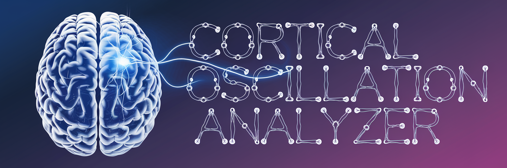

# COA (really just an EEG-based music generator)



A software application that converts EEG (electroencephalogram) data into musical compositions by analyzing brain wave frequency patterns.

## What It Does

This application processes EEG data, either from hardware devices or through simulation, to generate music that corresponds to detected brain activity patterns. The system:

1. Receives EEG data via OSC protocol
2. Analyzes frequency bands (Delta, Theta, Alpha, Beta, Gamma)
3. Creates a text prompt based on the dominant frequency patterns
4. Generates music using either local processing or cloud API

## Technical Requirements

- Python 3.7+
- PyTorch
- AudioCraft
- python-osc
- numpy
- scipy
- python-dotenv
- requests (for API calls)

## EEG Hardware Compatibility

This software expects EEG data to be transmitted via OSC (Open Sound Control) protocol to `127.0.0.1:65001` with the address pattern `/eeg`. The expected data format is an array of 5 floating-point values representing the power in each frequency band:

```
[delta_power, theta_power, alpha_power, beta_power, gamma_power]
```

### Compatible EEG Hardware (examples)

- **Research Grade:**
  - OpenBCI Ultracortex Mark IV (with OSC data streaming)
  - Emotiv EPOC+ (requires additional software to convert to OSC format)
  - Muse 2 or Muse S (requires MuseIO or similar to stream via OSC)

- **Consumer Grade:**
  - Neurosity Crown (with custom OSC bridge)
  - NeuroSky MindWave (requires additional software to convert to OSC)

Note: Most EEG devices will require additional software to format and stream data in the expected OSC format. This may involve using middleware or writing custom scripts to process the raw EEG data.

## Installation

### Windows and Linux

1. Clone this repository:
   ```
   git clone https://github.com/fizt656/eeg-music-generator.git
   cd eeg-music-generator
   ```

2. Run the installation script:
   ```
   # Windows
   install_and_run_windows.bat
   
   # Linux
   # First make the script executable
   chmod +x install_and_run_mac.sh
   # Then run it (works for Linux too)
   ./install_and_run_mac.sh
   ```

3. Set up your environment variables:
   - Copy `.env.example` to `.env`
   - Open `.env` and replace 'your_replicate_api_token_here' with your actual Replicate API token
   - Note: API token is only required if you plan to use the Replicate API for music generation

### macOS

1. Clone the repository:
   ```
   git clone https://github.com/fizt656/eeg-music-generator.git
   cd eeg-music-generator
   ```

2. Run the installation script:
   ```
   # First make the script executable
   chmod +x install_and_run_mac.sh
   # Then run it
   ./install_and_run_mac.sh
   ```

3. Set up your environment variables:
   - Copy `.env.example` to `.env`
   - Open `.env` and replace 'your_replicate_api_token_here' with your actual Replicate API token
   - Note: API token is only required if you plan to use the Replicate API for music generation

## Usage

### Command-line Options

The application supports several command-line options:

- `--eeg`: Use real EEG data for prompt generation
- `--simulate`: Use simulated EEG data for prompt generation
- `--local`: Use local AudioCraft instance instead of Replicate API
- `--duration DURATION`: Set the duration of the generated music in seconds (default: 8)

### Windows and Linux

```bash
# Using real EEG data with local generation
python music_generator_cuda.py --eeg --local

# Using simulated EEG data with Replicate API
python music_generator_cuda.py --simulate

# Manual prompt with local generation
python music_generator_cuda.py --local

# Specify music duration (in seconds)
python music_generator_cuda.py --local --duration 15
```

### macOS

```bash
# Using real EEG data with local generation
python music_generator_mac.py --eeg --local

# Using simulated EEG data with local generation
python music_generator_mac.py --simulate --local

# Manual prompt with local generation
python music_generator_mac.py --local

# Specify music duration (in seconds)
python music_generator_mac.py --local --duration 15
```

## Technical Details

### EEG Data Processing

The application processes EEG data in the following frequency bands:
- **Delta (0.5-4 Hz)**: Associated with deep sleep and healing
- **Theta (4-8 Hz)**: Associated with meditation and creativity
- **Alpha (8-13 Hz)**: Associated with relaxed alertness
- **Beta (13-30 Hz)**: Associated with active thinking and focus
- **Gamma (30+ Hz)**: Associated with higher cognitive processing

The system:
1. Collects EEG data through an OSC server listening on port 65001
2. Calculates the average power in each frequency band
3. Determines the dominant frequency band
4. Uses the Beta/Alpha ratio to assess emotional valence
5. Generates a text prompt based on these analyses

### Music Generation Methods

#### Local Generation (AudioCraft)
- Uses Meta's MusicGen model from the AudioCraft library
- Processes entirely on your local machine
- Outputs WAV format audio files
- Can utilize GPU acceleration if available

#### Cloud Generation (Replicate API)
- Uses Replicate's hosted version of MusicGen
- Requires internet connection and API token
- Outputs MP3 format audio files
- Generally produces higher quality results but depends on API availability

### Data Export

- EEG frequency data is saved to a CSV file: `eeg_frequency_data_YYYYMMDD_HHMMSS.csv`
- Generated music is saved as:
  - Local: `generated_music_{timestamp}.wav`
  - Replicate API: `generated_music.mp3`

## Troubleshooting

### EEG Connection Issues

- Verify your EEG device is correctly configured to send OSC messages to 127.0.0.1:65001
- Ensure the OSC message format matches the expected format (array of 5 floating-point values)
- Check that no firewall is blocking the connection
- If using custom middleware to convert your EEG data to OSC, verify it's functioning correctly

### API Issues

- If using the Replicate API, make sure your API token is correctly set in the `.env` file
- Check your internet connection
- Verify that you have not exceeded your API rate limits

### Audio Playback Issues

- If audio doesn't play automatically, the file path will be displayed in the console
- You can manually open and play the generated audio file using your preferred audio player
- For Mac users, you can use: `afplay /path/to/generated_music_file.wav`
- For Windows users, the file should open automatically with the default audio player

### CUDA/GPU Issues

- If you encounter CUDA-related errors, try running with CPU by removing the `--local` flag
- Ensure you have compatible NVIDIA drivers installed for GPU acceleration

## Simulation Mode

If you don't have EEG hardware, you can still test the application using the `--simulate` flag. This will generate random values for each frequency band to simulate EEG data. While this doesn't represent actual brain activity, it allows you to test the music generation functionality.

## License

This project is available under a dual license:

1. **Open Source Use**: MIT License - Free to use, modify, and distribute for non-commercial purposes.

2. **Commercial Use**: Prohibited without explicit written permission from the copyright holder.

See the [LICENSE](LICENSE) file for complete terms and conditions.

Copyright (c) 2024 Gus F. Halwani, PhD

## Acknowledgements

- AudioCraft by Meta Research for the MusicGen model
- Replicate for their API services
- python-osc for OSC protocol communication
- NumPy and SciPy for scientific computing and signal processing
- PyTorch for deep learning and GPU acceleration
- The developers of various EEG hardware and software that make brain-computer interfaces accessible
